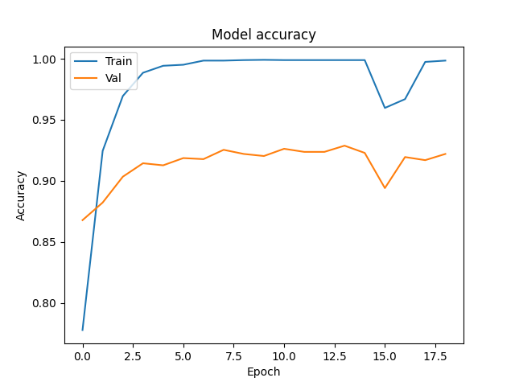
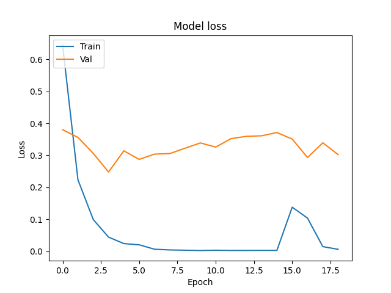

## summary

<hr>

## whatis
新システムとしてTesla V100SでSingularityでSlurmな環境が導入されたので、[BERT with SentencePiece を日本語 Wikipedia で学習してモデルを公開しました](https://yoheikikuta.github.io/bert-japanese/)を使って[livedoor ニュースコーパス](https://www.rondhuit.com/download.html)のジャンル推定するfine-tuningしてみた。

## requirements
- Singularity
- Slurm
- graphfviz
- Pipfile参照。
    - keras-bert, tensorflow(**2.x**), keras, sentencepiece, scikit-learn, (transformers=>削除), matplotlib, pydot
    - Pipfileからローカル環境構築したいなら、
        - (a) ``pip install pipenv`` でpipenv自体をインストール。
        - (b) Pipfileのあるディレクトリに移動。
        - (c) ``pipenv install --python /usr/local/bin/python3`` のように、使いたいPythonインタプリタを指定して環境構築。
        - (d) ``pipienv shell`` で構築した環境に対するシェルを起動。
        - (e) VSCodeとかでこの環境内のpythonを使いたいなら、``which python`` でインタプリタへのフルパスを確認し、使おう。

## howto
### 1. build a singularity container image
下記手順で生成したコンテナイメージ（test.sif）を適当な場所に保存。

```shell
singularity build --fakeroot --sandbox test docker://tensorflow/tensorflow:latest-gpu-py3
singularity shell --fakeroot --writable test
apt-get update
apt-get install -y --no-install-recommends graphviz
pip install keras-bert tensorflow keras sentencepiece scikit-learn transformers matplotlib pydot
#rm -rf /var/lib/apt/lists/* #コンテナイメージを小さくしたいなら実行。
exit
singularity build --fakeroot test.sif test
```

### 2. ready for pre-trained models
- [BERT with SentencePiece を日本語 Wikipedia で学習してモデルを公開しました](https://yoheikikuta.github.io/bert-japanese/)からダウンロード。
    - wiki-ja.*: SentencePieceの学習済みモデル。
    - model.ckpt-1400000.*: SentencePiece+BERTで学習済みモデル。
    - これらを ``~/model/bert-wiki-ja/`` に配置すると仮定。もしくは [train.py](./train.py) の ``pretrained_path`` を置いた場所に修正しよう。
- [bert_config.json](./bert_config.json) を準備。
    - ここでは前述の学習済みモデルと同じディレクトリに保存すると仮定。

### 3. ready for dataset
[livedoor ニュースコーパス](https://www.rondhuit.com/download.html)から ``ldcc-20140209.tar.gz`` をダウンロードし、展開。これを ``~/data/livedoor-text/`` に配置すると仮定。もしくは [train.py](./train.py) の ``dataset_path`` を置いた場所に修正しよう。

### 4. ready for sources
- ここのクローンを用意。
- fine-tuning したモデルは ``pretrained_path/model_livedoor.h5`` として保存します。変更したい場合には ``model_path`` を修正してください。

### 5. ready for a batch file for Slurm
- [train.sbatch](./train.sbatch) のようにバッチファイルを準備。SIFイメージやtrain.pyを置く場所を変更しているなら修正しよう。

### 6. run 
Slurmにジョブを投入。実行ログは ``logs/`` に保存されます。

```shell
sbatch train.sbatch
```

<hr>

## notes
- データセット上の処理。
    - [livedoor ニュースコーパス](https://www.rondhuit.com/download.html)に含まれる本文は、冒頭1行目がURL、2行目がタイムスタンプです。これらはジャンル推定に全く寄与しないか、もしくはURLから判定しやすくなる可能性があります。このため冒頭2行は除外し、3行目から利用しています。なお、3行目はタイトルでありかなり重要な情報が含まれているため、これも除外する人もいますが、今回は含めたままにしています。
- 利用している学習済みモデルに伴う制約。
    - [BERT with SentencePiece を日本語 Wikipedia で学習してモデルを公開しました](https://yoheikikuta.github.io/bert-japanese/)は、最大文字数（max_position_embeddings）が512です。これに制御文字としての``[CLS]``, ``[SEP]``の2文字分を確保した510文字がBERTに入力可能な最大文字数です。前述の通りlivedoorコーパスの冒頭2行は除外するため、3行目から数えて最大510文字までを利用する。句読点・カンマピリオド・改行等による文判定はしていない。
- BERTで用いているTensorFlow, tf.keras, Keras, PyTorch,,等のバージョンに注意。
    - 例えば[初出のBERT](https://github.com/google-research/bert)はTensorFlow 1.xでのみ動作。なお、TensrFlow 2.x では[contribuを除けばmigrationで対応できる](https://www.tensorflow.org/guide/migrate)とあるが、BERTはcontribを用いているためこれでは対応しきれない。公式パッチ作るつもりで暫く取り組んでみたがあまりにもエラー頻出するため断念した。
- tf.keras なのか Keras なのか keras-bert なのか問題。
    - GitHub上の初出BERTとは別に、BERT実装は豊富に提供されている。されすぎているかもしれない。これらが混在しているため、keras利用する際にはどれを使っているのか確認しよう。
- GPU使う場合
    - Singularityでコンテナイメージを作成するなら、利用するパッケージのGPU版イメージをダウンロードし、そこからsandbox作成してカスタマイズする流れが恐らく最もスムーズ。
        - 当初全てのパッケージを含むコンテナを作ろうと試行錯誤していた。ぶっちゃけそっちの方に圧倒的に時間かけたのだけど無駄足だった感。。PyTorchはconda、TensorFlowはpip（とbazel）のため[混ぜないほうがベター](http://onoz000.hatenablog.com/entry/2018/02/11/142347)。
        - なお、GPU版パッケージが動作しているかどうかを確認するには ``singularity shell --nv`` で起動した状態で確認しよう。

```Python
# Tensorflow の動作確認
import tensorflow as tf
print(tf.test.is_gpu_available)
print(tf.test.gpu_device_name()) # => GPU (device: 0, name: Tesla V100S-PCIE-32GB, pci bus id: 0000:3b:00.0, compute capability: 7.0)

# PyTorchの動作確認
import torch
print(torch.cuda.is_available()) #=> True
print(torch.version.cuda) # => 11.0
print(torch.backends.cudnn.enabled) # => 11.0
```

<hr>

## others
### 学習中のGPU利用状況
ミニバッチ16とそれほど大きくないですが、結構メモリ食ってる？

```
amane:tnal% nvidia-smi
Wed Dec  2 19:58:57 2020       
+-----------------------------------------------------------------------------+
| NVIDIA-SMI 450.80.02    Driver Version: 450.80.02    CUDA Version: 11.0     |
|-------------------------------+----------------------+----------------------+
| GPU  Name        Persistence-M| Bus-Id        Disp.A | Volatile Uncorr. ECC |
| Fan  Temp  Perf  Pwr:Usage/Cap|         Memory-Usage | GPU-Util  Compute M. |
|                               |                      |               MIG M. |
|===============================+======================+======================|
|   0  Tesla V100S-PCI...  Off  | 00000000:3B:00.0 Off |                    0 |
| N/A   58C    P0   122W / 250W |  31027MiB / 32510MiB |     74%      Default |
|                               |                      |                  N/A |
+-------------------------------+----------------------+----------------------+
                                                                               
+-----------------------------------------------------------------------------+
| Processes:                                                                  |
|  GPU   GI   CI        PID   Type   Process name                  GPU Memory |
|        ID   ID                                                   Usage      |
|=============================================================================|
|    0   N/A  N/A   3367442      C   /usr/local/bin/python           31023MiB |
+-----------------------------------------------------------------------------+
```

### 実行結果（時間比較）
- 学習済みモデルからベクトル生成する部分でもかなり時間かかってます。このため、ベクトル生成（7376文書）、fine-turning（``EPOCHS=10, BATCH_SIZE=16``）、全体の3つに分けて時間比較してみました。
- GPUなし（CPUのみ）
    - ベクトル生成に13912秒。約1.8文書/1秒。
    - fine-tuningに14667秒。約1466秒/1エポック。
    - 全体の処理時間は7時間57分52秒。約477分。
- GPU1個使った場合の例。
    - [logs/sample.txt](./logs/sample.txt)
    - ベクトル生成に741秒。約10文書/1秒。
        - CPUと比べて約18.7倍高速。
    - fine-tuningに266秒。約26秒/1エポック。
        - CPUと比べて約55.1倍高速。ヒャッハー！モデルサイズ、エポック数、バッチサイズとの兼ね合いでも変わってきそう。
    - 全体の処理時間は17分20秒。
        - CPUと比べて約27.5倍高速。
- GPU2個（2ノード）
    - ベクトル生成に758秒。
    - fine-tuningに274秒。
    - 全体の処理時間は17分42秒。
- GPU4個（4ノード）
    - ベクトル生成に734秒。
    - fine-tuningに267秒。
    - 全体の処理時間は17分10秒。

### 分類精度
- EaryStopping入れたら8エポックで終了。精度約92.4%。ランダムシャッフルしてるので結果は変動します。文分割・トークン分割・ステミングみたいな自然言語処理ならではの前処理をほぼせずともこれぐらいでました。文書の前処理、モデル設計、パラメータチューニング次第ではまだ上がりそうな気がします。
- 
- 

<hr>

## todo?
- refactoring

## change logs
- 2020/12/2, 1st commit
- 2020/12/3, add early stopping, visualize history

## referencese
- [keras-bert](https://github.com/CyberZHG/keras-bert)
    - [classification demo](https://github.com/CyberZHG/keras-bert/blob/master/demo/tune/keras_bert_classification_tpu.ipynb)
    - [SentencePiece + 日本語WikipediaのBERTモデルをKeras BERTで利用する](https://www.inoue-kobo.com/ai_ml/keras-bert/index.html)
